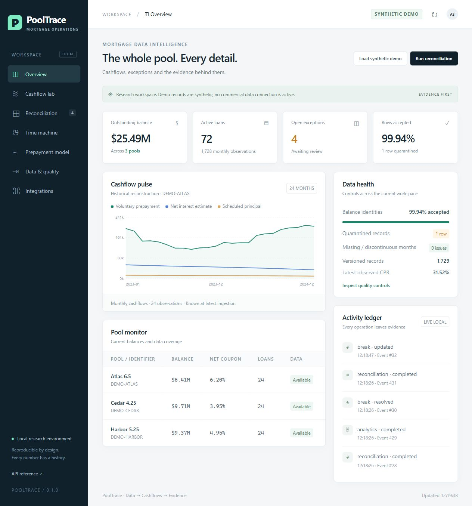

# PoolTrace

**A mortgage data and reconciliation workbench where every number has a history.**

PoolTrace follows one operational question from source to resolution: **a historical correction arrived—what changed, why, and which result did we know before it?**

It combines an immutable ingestion ledger, bitemporal loan observations, mortgage cashflow estimates, scenario analytics, prepayment research and an exception workflow. A local API and a separate event consumer show how another system can integrate with it.

> **v0.1 · Research prototype.** The included 72 loans, three pools and reference results are synthetic. No PolyPaths, Bloomberg or Intex connection is active. The Freddie Mac adapter follows a documented layout and is tested with constructed fixtures; no restricted agency tape is bundled or claimed as validated.



[Point-in-time comparison](docs/screenshots/time-machine.jpg) · [Exception workflow](docs/screenshots/reconciliation.jpg) · [Mobile view](docs/screenshots/mobile.jpg)

## Run locally

Python 3.10–3.12. No account, API key, Node installation or paid service is required to run the app. Initial dependency installation requires internet access.

```powershell
# Windows, from the repository folder
.\run.ps1
```

Or use the portable commands:

```sh
python -m venv .venv
# Windows: .venv\Scripts\activate
# macOS/Linux: source .venv/bin/activate
python -m pip install -r requirements-lock.txt
python -m pip install -e '.[test]' --no-deps
python -m pooltrace demo
python -m pooltrace serve
```

Open **http://127.0.0.1:8765**. OpenAPI: **http://127.0.0.1:8765/docs**. Runtime files stay under ignored `data/`. To create a separate research workspace, set `POOLTRACE_DATA_DIR` to another directory.

Docker configuration is included as an alternative: `docker compose up --build`. Its host port is bound to loopback. Current validation covers the Python workflow; Docker execution remains unverified.

## A five-minute demonstration

1. **Overview:** explore the 72 loans, 24 months and three synthetic fixed-rate pools.
2. **Data & quality:** reimport the demo. The content fingerprint makes the second import a no-op. Inspect the quarantined balance error, then recover the missing month.
3. **Cashflow lab:** change CPR and discount assumptions; compare price, WAL, fixed-cashflow duration and illustrative stochastic OAS. Each run stores its input fingerprint.
4. **Run reconciliation:** Atlas contains different reference assumptions; Harbor contains an unexplained price residual. Inspect the measured residual after matching assumptions.
5. **Time machine:** apply the late correction. Compare the original and revised prepayment, then inspect both knowledge intervals and the synthetic identifier change.
6. **Reconciliation:** assign an owner, investigate and resolve a difference with a note. Rerunning unchanged evidence preserves the review; new evidence reopens it.
7. **Integrations:** run `python examples/consume_events.py` twice. The first execution imports events into a separate consumer database; the next imports only new events.

The demo records actual receipt timestamps separately from the historical reporting periods. Reconstructing historical publication vintages requires dated source releases.

## Implemented scope and evidence

| Capability | Implemented in v0.1 | Evidence / boundary |
|---|---|---|
| Ingestion | Canonical CSV, content hashes, schema validation, immutable raw files, quarantine, idempotence | Duplicate keys and cross-source collisions are tested. Imports are bounded at 2 MB / 10,000 rows. |
| Agency data adapter | Freddie SFLLD performance, R47 and pre-R47 layouts, original measures and version history | Fixture-tested parser. Credit performance is kept separate from security disclosures. No automated agency downloader. |
| Historical cashflows | Scheduled principal, explicit voluntary prepayment, other reductions and net-interest estimate | Synthetic/canonical observations. No assertion of contractual issuer-payment replication. |
| Valuation | Representative fixed-rate loan, price, WAL, fixed-cashflow duration, convexity, assumed stochastic OAS | Principal conservation, independent zero-coupon case and deterministic seeds are tested. OAS is not market calibrated. |
| Reconciliation | Price/WAL/duration and optional OAS references; tolerances; comparability checks; numerical attribution | Synthetic reference scenarios, not independent vendor validation. Incompatible conventions remain review items even with equal values. |
| Point-in-time history | Monthly valid intervals and real system-time intervals; preserved restatements | Concurrent revisions, old knowledge and boundary queries are tested. |
| Backfill and identifiers | Gap recovery from known fixtures; non-destructive temporal aliases | Backfills use source observations, without interpolation. Identifier examples are synthetic. |
| Prepayment research | Exposure-weighted logit-SMM ridge baseline; chronological holdout; CPR errors | Later targets do not change fitted coefficients. Fitted synthetic data is not evidence of predictive skill. |
| Operations | Exception queue, age, ownership, notes, tolerances, trend by run, audit events | Persistent SQLite state. Analyst names are labels, not authenticated identities. |
| Integration | FastAPI/OpenAPI, versioned JSON contracts, point-in-time CSV export, ordered event API, durable consumer example | Local request/response and consumption verified. Vendor-specific adapters remain unimplemented. |

See [methodology](docs/METHODOLOGY.md), [source access](docs/DATA_SOURCES.md), [architecture](docs/ARCHITECTURE.md) and the [roadmap](docs/ROADMAP.md).

## Verification

```sh
python -m pytest -q
python scripts/demo_evidence.py
python scripts/export_contracts.py
# Optional frontend syntax check, when Node is installed:
node --check src/pooltrace/web/app.js
```

On a machine with unrelated global pytest plugins, use an isolated environment or set `PYTEST_DISABLE_PLUGIN_AUTOLOAD=1`.

The local suite has **24 passing tests**. CI is configured for Python 3.10, 3.11 and 3.12; hosted results are available in the repository's Actions tab after a workflow runs. [Demo evidence](docs/demo-evidence.json) is generated by an isolated local run, including 1,727 accepted observations, one quarantined row, zero changed rows on reimport, one recovered month and the $1,750 historical correction. Regenerate it to see fresh timestamps. See the [validation report](docs/VALIDATION.md) for the tested scope.

## Importing your own data

Download the canonical example from the Data & quality view. Populate only observations you can substantiate. Amounts are decimal USD, rates are decimal fractions, reporting periods are the first of the month, and schema version is `1.0`. Explicit principal components are required; balance changes alone are not sufficient to derive voluntary prepayment.

```sh
python -m pooltrace ingest private/loan_months.csv --source my-authorized-source
python -m pooltrace freddie private/perf_2026Q1.txt --release r47
```

The Freddie parser expects the **layout of the release**, not the origination year in the filename: R47 has 35 pipe-delimited fields and no header; the earlier profile has 32. It preserves credit observations in a separate ledger. You can also upload the tape through the dashboard.

Commercial metric exports can be transformed into [the reference contract](contracts/reference-v1.json) and submitted to `POST /api/v1/references`. Provide the source, valuation date, conventions, CPR, discount rate and duration definition. This generic import is not a vendor-certified integration. Bundled reference results are generated by PoolTrace's synthetic scenarios.

## Repository map

```text
src/pooltrace/
  api.py          HTTP contracts and local workbench
  db.py           SQLite ledger and point-in-time queries
  ingest.py       Validation, revisions, quarantine and coverage
  freddie.py      Versioned SFLLD performance adapter
  analytics.py    Cashflows, valuation and prepayment benchmark
  reconcile.py    Compatibility, attribution and exception state
  demo.py         Deterministic synthetic cases
  web/            Seven interactive working views
tests/            Financial, temporal, workflow and API invariants
contracts/        Generated OpenAPI and versioned JSON schemas
examples/         An independent event consumer
docs/             Methodology, evidence, architecture and roadmap
```

**Stack:** Python, FastAPI, Pydantic, NumPy, SQLite, semantic HTML/CSS and JavaScript. The small local stack makes the demonstration reproducible; replacing its persistence and scheduler with production services is an explicit later decision.

The MIT license covers project code and synthetic fixtures. Third-party data retains its own terms. The included examples use synthetic data; production deployment and external vendor validation are outside the v0.1 scope.
