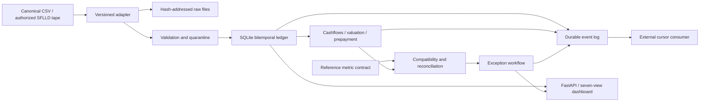

# Architecture and integration decisions

## Decisions

**SQLite + immutable local raw storage.** The initial product must run locally without accounts or cloud costs. SQLite provides real transactions, foreign keys, unique constraints, WAL and temporal queries. `BEGIN IMMEDIATE` serializes ingestion version transitions. This is a single-workstation design, not a distributed warehouse benchmark.

**Separate credit data and security data.** Imported SFLLD observations live in `performance_versions`. Explicit canonical loan/pool observations live in `loan_versions`. A parser does not manufacture the missing security link. Agency MBS adapters need a separate documented mapping.

**Domain functions separate from HTTP.** Analytics and ingestion are ordinary Python modules with direct tests. FastAPI validates request contracts and exposes them through OpenAPI. The static UI uses the same API that another system can consume.

**Recompute rather than stale cache.** Each requested run reads a pinned knowledge snapshot and stores the input hash and result. Corrections do not silently rewrite prior results. New runs incorporate changed versions. The event identifies all affected pools, including the previous pool when membership changes. Automatic distributed recalculation jobs are not implemented.

**Transactional event log.** Domain events are written in the same transaction as ingestion or workflow changes. `GET /api/v1/events?after=N` returns ordered records. The independent example consumer inserts events and advances its durable checkpoint transactionally. At-least-once delivery must be paired with idempotent downstream effects. Delivery uses a pull API; no message broker is required.

**Local access.** The CLI binds to loopback. Trusted-host checking restricts accepted hostnames, no CORS policy grants cross-origin access, and mutations require a custom header. An optional `POOLTRACE_API_KEY` enables bearer authorization for script clients; the browser UI currently has no key-entry flow. Do not expose this demo on the internet without deployment authentication, identity/roles, HTTPS, rate limits, upload limits at the proxy and operational review.

**Frontend scope.** HTML/CSS/JavaScript require no build step or network font/CDN for the dashboard. The generated Swagger UI uses its standard external assets; the `/openapi.json` contract works offline. One feature-detected read-only WebMCP tool exposes the same workspace overview when supported by the browser.

## Useful contracts

| Method / path | Purpose |
|---|---|
| `POST /api/v1/ingest` | Canonical CSV body, source, optional publication time |
| `POST /api/v1/freddie/performance` | Versioned pipe-file performance import |
| `GET /api/v1/freddie/performance` | Current or knowledge-time credit observations |
| `GET /api/v1/pools/{id}/history?knowledge_at=...` | Historical cashflows using a pinned knowledge snapshot |
| `POST /api/v1/pools/{id}/analyze` | Scenario, metrics and stored input fingerprint |
| `POST /api/v1/references` | An explicitly identified reference valuation |
| `POST /api/v1/pools/{id}/reconcile` | Compatibility, attribution and exception persistence |
| `PATCH /api/v1/breaks/{id}` | Owner/status/note with before-and-after event |
| `GET /api/v1/events?after=N` | Incremental external integration |
| `GET /api/v1/export/{id}?knowledge_at=...` | Canonical CSV for a knowledge snapshot |

`contracts/` is generated from code. CI checks for drift. Request changes that break these contracts should receive a new version rather than silently reinterpreting an existing field.

## Scale boundaries

The initial importer reads one bounded file into memory. Overview and model fitting scan the local current snapshot. It is designed for a single-workstation research workload. Streaming ingestion, columnar storage, partitioned processing and durable jobs belong to the next architecture stage; large-volume throughput has not been benchmarked.
